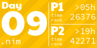
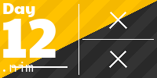

# Advent of Code 2022

My solutions to problems from AOC 2022, written in Nim.

## Dependencies

Install Nim
```sh
curl https://nim-lang.org/choosenim/init.sh -sSf | sh
```

## Create and run template

```sh
source create.sh <number>
nim c -o:bin/day<number> -d:release -r day<number>.nim
```

## Solutions
<!-- AOC TILES BEGIN -->
<h1 align="center">
  2022 - 28 ⭐
</h1>
<a href="day01/day01_v2.nim">
  
</a>
<a href="day02/day02_v2.nim">
  
</a>
<a href="day03/day03.nim">
  
</a>
<a href="day04/day04.nim">
  
</a>
<a href="day05/day05.nim">
  
</a>
<a href="day06/day06.nim">
  
</a>
<a href="day07/day07.nim">
  
</a>
<a href="day08/day08.nim">
  
</a>
<a href="day09/day09.nim">
  
</a>
<a href="day10/day10.nim">
  
</a>
<a href="day11/day11.nim">
  
</a>
<a href="day12/day12.nim">
  
</a>
<a href="day13/day13.nim">
  
</a>
<a href="day14/day14.nim">
  
</a>
<a href="day15/day15.nim">
  
</a>
<a href="day16/day16.nim">
  
</a>
<a href="day17/day17.nim">
  
</a>
<a href="day18/day18.nim">
  
</a>
<a href="day19/day19.nim">
  
</a>
<a href="day20/day20.nim">
  
</a>
<a href="day21/day21.nim">
  
</a>
<!-- AOC TILES END -->